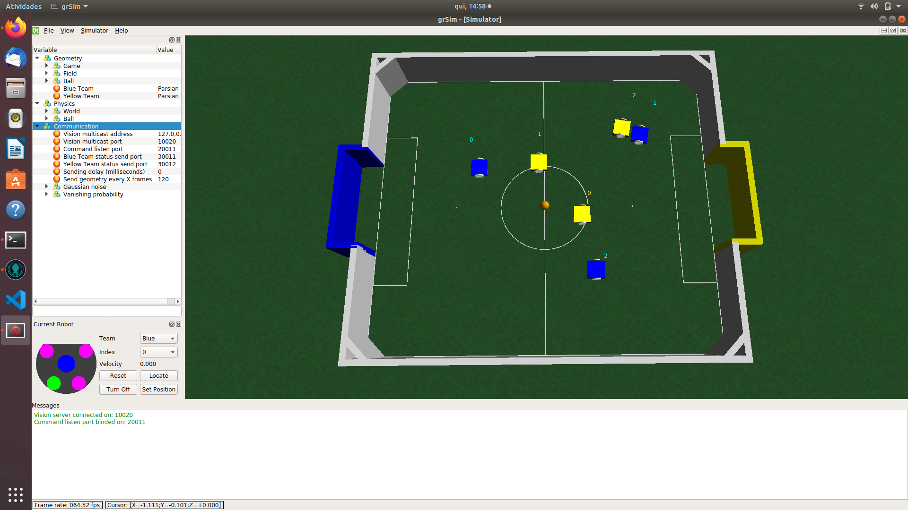

# fira-client
> Client base code #vss #LARC #ssl-vision #FiraSim 

## Description
This repository was created for the purpose of helping beginner teams.
This project is capable of:
- receive field and robot information from FiraSim
- Send commands to robots on grSim

Almost every material present here can be found at:

 [RoboCup/ssl-vision](https://github.com/RoboCup-SSL/ssl-vision)

 [Robocin/FIRASim](https://github.com/robocin/FIRASim)


Feel free to ask and contribute too :)

## Dependencies
- Qt Creator (remember to go in project and disable "shadow build")
- [protobuf](https://github.com/google/protobuf)

*Tested with: Qt 5.8.0, protoc 3.x, Ubuntu 14.04.5 LTS.*

## First Steps
1. If you have protobuf installed, check which version you use with the command:
```sh
protoc --version
```

1. If you do not , follow the instructions in [C++ Installation - Unix](https://github.com/google/protobuf/tree/master/src).

1. According to its version download the referent in [protobuf/tags](https://github.com/google/protobuf/tags).

1. Extract the downloaded file and go to `/protobuf-3.0.0/src/` *(example version)*.

1. Copy the google folder and paste it into `/ssl-client/ssl-Client/include/`

1. Go to folder `/ssl-client/ssl-Client/pb/proto/` and run:
```sh
sh compile.sh
```

*Obs: when building the program, if something referring to `google/protobuf/stubs/common.h` has any errors, it will probably be an incompatibility version problem with protobuf (`include/google`)*.

## Usage example
1. Open the FiraSim.


1. Get the Vision multicast adress, Vision multicast port and Command listen port on grSim.


1. In Qt Creator IDE open the project thru the `ssl-Clienty.pro` file. In Projects (left options) un-check the `Shadow build`!

1. Go to `/ssl-client/ssl-Client/net/robocup_ssl_client.h` and paste the Vision Multicast adress and the Vision Multicast port on `string net_ref_address `and `int port`, respectively.


1. Go to `/ssl-client/ssl-Client/net/grSim_client.cpp` and paste the Vision Multicast adress and the Command listen port on `this->_addr.setAddress()`and `this->_port = quint16()`, respectively. 


1. Run the Qt Project!

#### Author: [Renato Sousa](https://github.com/renatoosousa)/Robocin (https://github.com/robocin)

